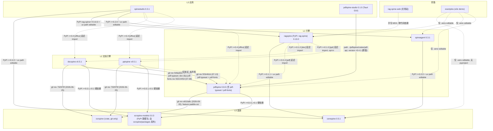

# Spine 家族：成员、分层与依赖关系

> 本文件在家族每个仓库的 `docs/spine-family.md` 各有一份**内容完全相同**的副本，真源是家族根目录
> `~/startup/spine/docs/spine-family.md`，用根目录 `make family-doc-sync` 同步、`make family-doc-check` 校验；
> 修改请改真源再同步，不要只改某一个副本。
>
> 数据截至 **2026-09-07**，由代码与配置实测得出（`pyproject.toml` / `Cargo.toml` / `Cargo.lock` / `uv.lock` /
> 真实 `import` 与 `use` / `git log`），**不是仅凭意图文档**。证据路径写作 `<repo>/相对路径:行号`。

**本文回答的问题**

1. 这个家族为什么存在，"掌握 RAG 各组件"落到代码上是什么意思 → [§1](#1-家族目的)
2. 家族有哪些成员、各自是什么语言、发布到哪里、活不活跃 → [§2](#2-成员总表)
3. 谁依赖谁、方向是什么、有没有环 → [§3](#3-分层与依赖方向图)
4. 每条依赖具体是什么形式（git rev / PyPI / path / 延迟 import）、钉在哪个版本 → [§4](#4-实际依赖矩阵)
5. 打开某一个仓时，它的角色、边界、对外暴露、上下游分别是什么 → [§5](#5-逐成员章节)
6. 意图文档（根 README / CLAUDE.md / ADR 0001）与实际代码差在哪里 → [§6](#6-意图-vs-实际差距清单)
7. 这份文件怎么维护，AI agent 跨仓工作时要遵守什么 → [§7](#7-维护规则)

---

## 1. 家族目的

用户自述（2026-09-07）：

> "spine 下面有好几个项目，这是我刻意做的一个家族，主要是为了 RAG 的各个 component 我希望能掌握在自己的手上。
> 相互之间的关系现在我有点混乱了。"

"掌握 RAG 各组件"在实际代码里的含义是：RAG 流水线上每一个原本要靠第三方库或云服务的环节，家族里都有一个自研成员负责——

| RAG 环节 | 负责成员 | 说明 |
|---|---|---|
| PDF 解析 / 表格 / 渲染 / 排版 | `pdfspine` | 纯 Rust 重实现 PyMuPDF 面，附带家族共享排版引擎 `pdf-typeset` |
| Word / PPT 解析与导出 PDF | `docspine` / `pptspine` | 纯 Rust OOXML 解析器，导出 PDF 走 `pdf-typeset` |
| OCR（像素 → 词） | `ocrspine` + 数据包 `ocrspine-models` | PP-OCRv5 / tract-onnx，全离线 |
| 检索、双通道问答、反捏造 | `ragspine` | framework-free RAG 引擎，PyPI 名 `rag-spine` |
| 多 agent 编排、MCP / A2A 缝 | `spineagent` | 通用 agent 框架，不含 RAG 概念 |
| 缝元模式、trace、LLM 协议、conformance 基座 | `corespine` | 薄共享核，零依赖 |
| 应用层（聊天 / 知识库 / 管理台） | `spinestudio` | 唯一的产品应用；`pdfspine-studio` 是另一个独立的 PDF 桌面 GUI |
| 文档站 | `rag-spine-web` | Fumadocs 静态站 monorepo，rag-spine.org |
| 端到端示例 | `examples` | 一个离线 e2e demo |

实测结论（详见 [§5.2 ragspine](#52-ragspine)）：这个目标目前做到约七成——PDF 表格、扫描 PDF OCR、`.docx`
已经默认走家族自研；`.pptx` 默认仍是第三方 python-pptx，PDF 叙事文本默认仍是 pypdfium2。

---

## 2. 成员总表

11 个成员，全部是家族根目录 `~/startup/spine/` 下的**独立 git 仓库**（根目录本身不是 git 仓库）。

| 目录 | GitHub 远程 | 语言 / 栈 | 发布包名（import 名）与版本 | 发布状态 | 层级角色 | 最近提交 / 提交数 | 活跃度 |
|---|---|---|---|---|---|---|---|
| `corespine/` | `VoldemortGin/corespine` | Python（stdlib only，hatchling） | `corespine` 0.5.1 | 已发 PyPI（Trusted Publishing） | L0 底座 | 2026-09-06 / 33 | 活跃 |
| `ocrspine/` | `VoldemortGin/ocrspine` | Rust 单 crate | crate `ocrspine` 0.0.1（`publish = false`）；数据包 `ocrspine-models` 0.0.3 | crate 仅 git dep；`ocrspine-models` 已发 PyPI | L0 底座 | 2026-09-06 / 11 | 活跃（小） |
| `ragspine/` | `VoldemortGin/ragspine` | Python（hatchling，FastAPI，内置 Vite 前端） | **`rag-spine`**（import `ragspine`）0.13.0 | 已发 PyPI | L1 引擎 | 2026-09-03（实质功能停在 08-03）/ 245 | 活跃，最成熟 |
| `spineagent/` | `VoldemortGin/spineagent` | Python（hatchling） | `spineagent` 0.3.1 | 已发 PyPI | L1 引擎 | 2026-07-30 / 42 | 停滞约 5 周 |
| `pdfspine/` | `VoldemortGin/pdfspine` | Rust 2021 + PyO3 0.29 + maturin | `pdfspine` 0.8.0（2026-09-10 发布）；13 个 crate 全 `publish = false` | 已发 PyPI；crates.io 未发 | L1 引擎（含 `pdf-typeset` / `pdf-fonts` 被 git dep） | 2026-09-07 / 339 | 最活跃 |
| `docspine/` | `VoldemortGin/docspine` | Rust + PyO3 + maturin | `docspine`，tag v0.5.1（Cargo 内长期 0.0.1 占位） | 已发 PyPI | L2 文档引擎 | 2026-07-30 / 29 | 停滞 |
| `pptspine/` | `VoldemortGin/pptspine` | Rust + PyO3 + maturin | `pptspine`，tag v0.5.1（Cargo 内 0.0.1 占位） | 已发 PyPI | L2 文档引擎 | 2026-07-30 / 37 | 停滞 |
| `spinestudio/` | `VoldemortGin/spinestudio` | Python（FastAPI）+ TS（Next.js 16）+ Python SDK | `spinestudio` 0.3.1、`spinestudio-sdk` 0.2.1、`spinestudio-web` 0.1.0（private） | 有 `dist/` 与 tag，**无 release CI**，大概率未上 PyPI | L3 应用 | 2026-07-30 / 46 | 停滞 |
| `pdfspine-studio/` | `VoldemortGin/pdfspine-studio`（private，2026-09-09 新建） | Rust 2024 + Tauri 2 + Vite/React/TS | workspace 0.1.0，私有 | 未发布 | L3 应用（GUI） | 2026-07-22 / 6 | 停滞，且当前构建不了 |
| `rag-spine-web/` | `VoldemortGin/rag-spine-web` | TS（pnpm + Turborepo + Next.js 16 + Fumadocs） | `@rag-spine/*` 四个 app，不发布 | 部署到 Cloudflare Pages | 旁路：文档站 | 2026-07-20 / 33 | 明显偏冷 |
| `examples/` | `VoldemortGin/spine-examples` | Python 脚本 | 无包 | 未发布 | 旁路：示例 | 2026-06-23 / 1 | 只有 1 个 commit |

远程地址与最近提交经 `git remote get-url origin` / `git log -1` 于 2026-09-07 逐仓核实。

另有 `dify_debug/`（第三方 Dify 源码，调试用）与 `var/`，不是家族成员，本文不覆盖。

---

## 3. 分层与依赖方向图

### 3.1 实际依赖边（mermaid）



实线 = 进 `dependencies` / `[workspace.dependencies]` 的硬边；虚线 = 可选 extra 延迟 import、测试期或非声明的弱边。
`spineagent → ragspine` **没有边**：代码里 0 处 import，只在 docstring 里声明"运行时可当 Tool/MCP 组合"（`spineagent/src/spineagent/__init__.py:7-8`）。

### 3.2 等价 ASCII 分层图

```
L3 应用     spinestudio ──────────────┐            pdfspine-studio
             │ in-process import       │                │ path dep (=0.4.1, 断裂)
             │ (corespine/ragspine/    │ [office]       │
             │  spineagent)            │ 延迟 import    │
             ▼                         ▼                │
L2 文档引擎              docspine     pptspine           │
                            │ git rev    │ git rev       │
                            │ (pdf-typeset / pdf-fonts)  │
                            ▼            ▼               ▼
L1 引擎     ragspine   spineagent      pdfspine ◄────────┘
             │ PyPI+path │ PyPI+path     │ git rev e810a9c (paddle-ocr)
             │           │               │ + PyPI ocrspine-models
             ▼           ▼               ▼
L0 底座     corespine (deps=[])        ocrspine (crate, 零依赖)
                                        └── packages/ocrspine-models → PyPI（pdfspine/docspine/pptspine 硬依赖）

旁路        rag-spine-web（4 站，手写 MDX，零代码依赖）   examples（1 commit，串 corespine/pdfspine/ragspine/spineagent）

其他弱边    ragspine ··[pdf]/[doc]/[ppt] 延迟 import··> pdfspine / docspine / pptspine
            pptspine ··仅测试 import, 未声明··> pdfspine
```

### 3.3 实测结论

- **无环，方向与 ADR 0001 一致。** 引擎仓 0 处 import `spinestudio`；`corespine` `dependencies = []`
  且家族名只出现在注释（`corespine/src/corespine/errors.py:3-4`）；`ocrspine` 零家族依赖、`src/` 内 0 处领域符号；
  `spineagent` 的 `dependencies` 不含 `ragspine`（`spineagent/pyproject.toml`），代码 0 处 import。
- 分层是本文的**建议归类**，家族根 README/CLAUDE.md 只写了方向没有写层；分层与它们的方向表逐条兼容。

---

## 4. 实际依赖矩阵

行 = 依赖方，列 = 被依赖方。格内：形式 + 版本/rev + 代码引用数（真实 `import` / `use`，非文档提及）。`—` = 无依赖。

| 依赖方 \ 被依赖方 | corespine | ocrspine (crate) | ocrspine-models | ragspine | spineagent | pdfspine (含 pdf-typeset / pdf-fonts) | docspine | pptspine |
|---|---|---|---|---|---|---|---|---|
| **ragspine** | PyPI `>=0.1.1` + uv path editable（`pyproject.toml:39`, `:294`）；41 imports（src 25 / tests 24 处 import 行） | —（经 pdfspine 传递） | —（经 uv.lock 传递） | 自身 | **—**（0 import；仅 `dify/codegen/spineagent.py:65` 生成字符串） | PyPI `>=0.0.4` `[pdf]` 延迟 import（`pyproject.toml:85`；uv.lock 实解 0.4.0）；`extraction/extractors/pdf_spine_extractor.py:96`、`pdf_scanned_extractor.py:332` | PyPI `>=0.1.0` `[doc]` 延迟 import（`:107`）；`docspine_extractor.py:161`、`narrative_extract.py:163` | PyPI `>=0.1.0` `[ppt]` 延迟 import、opt-in（`:116`）；`pptspine_extractor.py:139` |
| **spineagent** | PyPI `>=0.2.0` + uv path editable（`pyproject.toml`）；73 imports（src ≈50） | — | — | **—**（docstring 声明运行时组合，0 import） | 自身 | — | — | — |
| **pdfspine** | —（1 处注释类比） | git rev `e810a9c` (2026-09-05)，feature `paddle-ocr` 门控（`crates/pdf-ocr/Cargo.toml:40`）；`paddle/mod.rs:23,38,66-67` | PyPI `>=0.0.1,<0.1` **硬依赖**（`pyproject.toml:43`）；`python/pdfspine/document.py:122` | — | — | 自身 | — | — |
| **docspine** | — | git rev `732975f` (2026-06-25)（`Cargo.toml:29`）；`doc-ocr/src/lib.rs:22` 等 3 处 use | PyPI `>=0.0.1,<0.1` 硬依赖；`python/docspine/__init__.py:56` | — | — | git rev `509a932e` (2026-07-13) `pdf-typeset`（`Cargo.toml:40`），12 处 use；dev-dep `pdf-fonts` git rev `93214453` (2026-07-08)（`crates/doc-render/Cargo.toml`），1 处测试 use；**同仓两个 rev** | 自身 | — |
| **pptspine** | — | git rev `732975f` (2026-06-25)（`Cargo.toml:28`）；`ppt-ocr/src/lib.rs:12` | PyPI `>=0.0.1,<0.1` 硬依赖；`python/pptspine/__init__.py:72` | — | — | git rev `5f1640cb` (2026-07-13) `pdf-typeset` + dev `pdf-fonts` 同 rev（`Cargo.toml:34,36`），19 处 use；另 **仅测试、未声明**：`python/tests/test_pdf_export.py:16 import pdfspine` | — | 自身 |
| **spinestudio** | PyPI `>=0.4.0` + uv path editable（`backend/pyproject.toml`）；5 imports | — | —（经 office 传递） | PyPI `rag-spine>=0.10.0` + uv path editable；12 imports（`chat/engine.py:5-7` 等） | PyPI `>=0.2.0` + uv path editable；6 imports（`admin/provider_factory.py:15` 等） | PyPI `>=0.4` `[office]` 延迟 import（`preview/renderer.py:56`）；不在 uv.sources | PyPI `>=0.4` `[office]` 延迟 import（`preview/renderer.py:36`） | PyPI `>=0.4` `[office]` 延迟 import（`preview/renderer.py:44`） |
| **pdfspine-studio** | — | — | — | — | — | **path** `../pdfspine/crates/pdf-api`, `version = "=0.4.1"`（`Cargo.toml:39`），pdfspine 现为 0.8.0 → 不满足；`crates/adapters/src/pdfspine.rs:6`；测试硬读 `../../../pdfspine/fixtures/` | — | — |
| **examples** | .venv editable（corespine 0.1.0）；3 imports | — | — | .venv editable（rag_spine 0.3.0） | .venv editable（spineagent 0.0.3） | .venv editable（pdfspine 0.0.1） | — | — |
| **rag-spine-web** | 手写 MDX | — | — | 手写 MDX（159 处文本命中） | 手写 MDX | 手写 MDX（含 docspine/pptspine 子目录） | 手写 MDX | 手写 MDX |
| **corespine / ocrspine** | — | — | — | — | — | — | — | — |

要点：

- **跨仓依赖实际存在三种形式**，不是意图文档写的"一律 git dep + 钉死 rev"：
  1. **Rust 侧：git dep + 钉死 rev**（pdfspine → ocrspine；docspine / pptspine → ocrspine、pdf-typeset、pdf-fonts），
     在 `[workspace.dependencies]` 一次声明。这是唯一与铁律相符的形式。
  2. **Python 侧：PyPI 版本约束 + `[tool.uv.sources]` 本地 path editable**（ragspine / spineagent / spinestudio → corespine 等）。
     发布时依靠 CI 的 `--no-sources` 把 path 层隔离掉（spineagent 有；spinestudio 无 release CI）。
     `ragspine/docs/llms/overview.md:87` 是全家族唯一坦白说明这种形式的文档。
  3. **pdfspine-studio 的裸 `path` 依赖**，越目录直指兄弟仓工作树，且带 `=0.4.1` 精确版本。
- **`ocrspine-models` 是 PyPI 数据包**，由 `ocrspine/packages/ocrspine-models/` 发布（hatchling，`hatch_build.py`
  构建期从 `../../models/` force-include；`.github/workflows/release-models.yml` OIDC）。pdfspine / docspine / pptspine
  三家 `pyproject.toml` 同款 `ocrspine-models>=0.0.1,<0.1` **硬依赖**；spinestudio 经 `[office]` 传递带入。
  它只打 zh/en/ja 默认 4 件套，**泰文权重不发布**（`hatch_build.py:12`）。
- `ocrspine` crate 本身 `publish = false`，不在 crates.io，只能被 git dep；Python 侧没有 ocrspine 绑定，只有数据包。

---

## 5. 逐成员章节

### 5.1 corespine

- **角色与边界**：L0 薄共享核。只装 domain-neutral 原语：缝注册表 `Registry` / 隐私 `TraceSink` / `LLMProvider` + `MockProvider` /
  config / blob / credential / queue / trigger / conformance 基座。"机制，不是保证"（ADR 0001 D6）：不变量由各消费者自绑。
- **对外暴露**：`src/corespine/__init__.py:81` 起 `__all__` 约 60 项；第三方扩展经 entry-point group `corespine.<seam>`
  （`src/corespine/seam/registry.py:64,69`）。无 CLI、无 HTTP、无 MCP。
- **依赖谁**：`dependencies = []`，可选 `crypto = ["cryptography>=42"]`。家族依赖 0 个。
- **被谁依赖**：ragspine（41 imports）、spineagent（73）、spinestudio（5）、examples（3）。
- **家族相关文档在哪**：`corespine/CLAUDE.md:8-9,23`、`corespine/README.md:4-5`、`docs/prd.md:67-70`（"让 ragspine/spineagent
  真正消费 corespine 是 rule-of-three 证据的唯一来源"）、`docs/adr/0002~0005`（每条以兄弟仓为证据）。
- **当前状态与注意事项**：0.5.1，2026-09-06 仍在动，家族最活跃的 Python 仓。发布走 PyPI Trusted Publishing。
  注意：`credential` 缝在家族内 **0 个真实消费者**——唯一候选 spinestudio 明确拒用
  （`spinestudio/backend/src/spinestudio/auth/api_key_store.py:5`："其 get() 语义是回读明文，与我们绝不回读的目标相反"）；
  `trigger` 缝只有 spinestudio 一家（`trigger/router.py:20`），`queue` 缝只有 ragspine 一家
  （`ragspine/src/ragspine/service/tasks/task_queue.py:23`）；`blob` 缝达标（spineagent artifact + spinestudio office）。
  `src/corespine/trigger/source.py:6` 注释里出现产品层包名 spinestudio，属领域概念轻度渗透。无 `[project.urls]`、无 CHANGELOG。

### 5.2 ragspine

- **角色与边界**：L1 RAG 引擎。framework-free、确定性双通道（结构化数值 + 叙事 RAG，agent 路由），反捏造 / 溯源是代码级不变量。
  PyPI 名 **`rag-spine`**，import 名 **`ragspine`**（spinestudio 的 health 路由按 `"rag-spine"` 查版本）。
- **对外暴露**：`src/ragspine/__init__.py:94` `__all__ = ("RAGSpine", "FactStore", "Fact", "MockProvider", "answer_question")`，其余惰性
  `__getattr__`；CLI `ragspine`（quick / ingest / ask / doctor / serve / dify / workflow…）；HTTP `src/ragspine/service/api/`
  （含 OpenAI 兼容 `POST /v1/chat/completions`）+ 内置 Studio 前端。无 MCP server（MCP/A2A 缝在 spineagent）。
- **依赖谁**：corespine `>=0.1.1` + path editable；`[pdf]` pdfspine `>=0.0.4`、`[doc]` docspine `>=0.1.0`、`[ppt]` pptspine `>=0.1.0`
  全是 PyPI 约束 + 延迟 import（uv.lock 三者实解 0.4.0）。**不依赖 spineagent**（只在 `dify/codegen/spineagent.py:65` 生成代码字符串）。
  全仓无任何 `git+…@rev`。
- **被谁依赖**：spinestudio（唯一真消费者，12 imports）；examples（.venv）。
- **家族相关文档在哪**：`llms.txt:12-14,21-24`、`docs/llms/overview.md:73-87`（"与 corespine 的关系"，6 条缝逐条列出；L87 坦白 path override）、
  `docs/llms/gotchas.md:54-57`（`make_vector_store` 用自己的 entry-point，**不是** `corespine.Registry`）。
  **`ragspine/CLAUDE.md` 一个字不提家族 / corespine**。
- **文档摄取各格式默认引擎**（实测）：

  | 格式 | 结构化（表格）默认 | 叙事文本默认 | 自研？ |
  |---|---|---|---|
  | PDF 数字型 | **pdfspine** `PdfSpineGridExtractor`（`ingestion/structured/ingestion.py:609`）；docling 降为 `[pdf-docling]` 兜底 | **pypdfium2**（`ingestion/narrative/narrative_extract.py:24`） | 表格是；叙事否 |
  | PDF 扫描型 | **pdfspine → ocrspine** `PdfSpineOcrBackend`（`pdf_scanned_extractor.py:280`） | 同上 | 是 |
  | `.docx` | **docspine**（`extraction/registry.py:117`） | **docspine**（`narrative_extract.py:163`） | 是 |
  | `.pptx` | **python-pptx**（`registry.py:111`）；pptspine 需显式 selector `'pptx+pptspine'` | python-pptx | 否（opt-in） |
  | `.xlsx` | openpyxl | — | 否 |
  | HTML / MD / CSV | 未做（`extraction/docs/extractor-registry.md:82`） | — | — |

- **当前状态与注意事项**：0.13.0，245 commits，最成熟。**registry 与 ingestion 的 PDF 默认引擎不一致**：
  `extraction/registry.py:108` `".pdf"` → `_load_pdf_digital`（docling 封装），而 ingest 主链路 `ingestion.py:609` → pdfspine。
  声明下限 pdfspine `>=0.0.4` 不含 `find_image_tables`，按下限安装时家族默认 OCR 路径会静默降级为空表 + 告警
  （`pdf_scanned_extractor.py` 注释）。`[all]` extra 漏 `tsr`、`graphrag-compat`。

### 5.3 spineagent

- **角色与边界**：L1 通用多 agent 框架：agent / tool / 编排 + MCP / A2A 协议缝、middleware、approval、artifact、sandbox、LLM provider 适配器。
  **不含 RAG 概念**（ADR 0001 D1）。
- **对外暴露**：`src/spineagent/__init__.py:155` 起 `__all__` 约 100 项（`Agent` 系列、`Coordinator`、`Tool`/`tool_registry`、5 个 LLM 适配器、`McpClient`）。
  MCP 侧是 `McpClient` / `McpServer` **Protocol** + `OfflineMcpStub`（`protocol/mcp/seam.py`），不是真实 server 进程
  （`deploy/README.md:94` 确认入口未落地）。无 CLI、无 HTTP。
- **依赖谁**：`corespine>=0.2.0`（实际 0.5.1）+ `beartype`；path editable。**无 ragspine、无 git dep**。
- **被谁依赖**：spinestudio（6 imports：`admin/router.py:15-16`、`skills/governance.py:24-25` 等）、examples。ragspine **不** import 它。
- **家族相关文档在哪**：`spineagent/CLAUDE.md:8-10,20,23-25`（"不在包层面依赖 ragspine…绝不写进 dependencies"）、`README.md:36-42`
  《运行时组合 ragspine（ADR 0001 D4b）》、`:50` entry-point group `corespine.tool`。
- **当前状态与注意事项**：0.3.1，2026-07-30 起停滞。README/CLAUDE.md 的核心承诺（不依赖 ragspine）**已兑现**。
  小漂移：`release.yml:12` 注释仍写 `corespine>=0.1.1`，pyproject 已是 `>=0.2.0`。`deploy/helm/` 是自认的"前瞻骨架"，当前无 server 入口。

### 5.4 pdfspine

- **角色与边界**：L1 PDF 引擎。Apache-2.0 纯 Rust 重实现 PyMuPDF(fitz)，PyO3 暴露 Python API（解析 / 文本 / 渲染 / 编辑 / OCR / 表格 / Markdown→PDF）。
  13 个 crate（`Cargo.toml:5-19`）：`pdf-core` / `pdf-crypto` / `pdf-fonts` / `pdf-text` / `pdf-edit` / `pdf-image` / `pdf-render` /
  `pdf-markdown` / `pdf-typeset` / `pdf-ocr` / `pdf-api` / `py-bindings` / `pdf-testdata`，全部 `publish = false`。
- **`pdf-typeset` 与 `pdf-fonts`**：`pdf-typeset`（`crates/pdf-typeset/src/lib.rs:1-50`）是 docx/pptx→PDF 忠实导出的**家族共享排版引擎**
  （字体解析 + 回退、measure→wrap→paginate、表格网格、绝对定位文本框、autoshape 轮廓、op IR→确定性 PDF 字节），
  re-export `pdf-core` / `pdf-edit` / `pdf-fonts` / `pdf-image` 让消费者只需一条依赖。`pdf-fonts` 是字体解析 crate，被两家作 dev-dep。
  两者**只经 git dep 对外**，被 docspine `doc-render`（12 处 use）与 pptspine `ppt-render`（19 处 use）真实消费。
- **对外暴露**：Python `pdfspine.__init__`（`open/Document/Page/Pixmap/TextPage/Table/TableFinder/ImageTable/markdown_to_pdf/install_fitz_shim…`）、
  兼容子模块 `pdfspine.fitz` / `pdfspine.pymupdf`、CLI `pdfspine`（`python/pdfspine/cli.py:317+`）。无 MCP。
- **依赖谁**：ocrspine git rev `e810a9c` (2026-09-05)，feature `paddle-ocr` 门控（`crates/pdf-ocr/Cargo.toml:40`）；
  `ocrspine-models>=0.0.1,<0.1` **硬依赖**（`pyproject.toml:43`，`ocr`/`all` extra 已退化为 no-op）。
- **被谁依赖**：ragspine `[pdf]`；spinestudio `[office]`；docspine / pptspine（git dep 取 `pdf-typeset` / `pdf-fonts`）；
  pdfspine-studio（path 取 `pdf-api`）；pptspine 测试（未声明）；examples。
- **家族相关文档在哪**：**没有 `CLAUDE.md`**（`git ls-files | grep -i claude` 为空），与家族 README"各子项目另有自己的 CLAUDE.md"不符。
  家族关系散在 `README.md:7,70,104,213`、`llms.txt`、`docs/RELEASE-PYPI.md`、`crates/pdf-typeset/Cargo.toml:1-4`、`crates/pdf-ocr/Cargo.toml:29-40`。
- **当前状态与注意事项**：0.8.0（2026-09-10 发布，CHANGELOG 已归档到 [0.8.0]），339 commits，最活跃；2026-09-09 起只有 `main` 分支，
  4 个未提交改动，本地 main 有 5 个 commit 未推。5 个 `.claude/worktrees/*` 仍钉 ocrspine 旧 rev `732975f`。
  `packages/pdfspine-ocr-models/` 旧伴随包残留，与 `ocrspine-models` 重复，仅作第 3 顺位回退。`dist/` 残留 0.4.0。

### 5.5 docspine

- **角色与边界**：L2 `.docx`（OOXML）结构化解析器（表格重点）+ 本地图片 OCR + 保真导出 PDF。crate：`doc-core` / `doc-parse` / `doc-ocr` / `doc-render` / `py-bindings`。
- **对外暴露**：`Document, open, open_bytes, probe_doc, ocr_image, reconstruct_image_table, DocError…`；`Document.to_pdf / save_pdf` → `doc-render` → `pdf-typeset`。无 CLI。
- **依赖谁**：ocrspine git rev `732975f` (2026-06-25)（`Cargo.toml:29`）；`pdf-typeset` git rev `509a932e` (2026-07-13)（`Cargo.toml:40`）；
  dev-dep `pdf-fonts` git rev `93214453` (2026-07-08)（`crates/doc-render/Cargo.toml`，未走 workspace）；`ocrspine-models>=0.0.1,<0.1` 硬依赖。
  脚本 `scripts/ssim_selfref.py:140`、`scripts/lo_oracle_ssim.py:137` `import pdfspine`（仅 SSIM 栅格化，未写进 pyproject）。
- **被谁依赖**：ragspine `[doc]`（默认 docx 引擎）；spinestudio `[office]`。家族内无其他代码 import。
- **家族相关文档在哪**：`docspine/CLAUDE.md`（"文档引擎三件套里的 doc，与 pdfspine / pptspine 共享 ocrspine"；"`../pdfspine/` 与 `../pptspine/` 只读"；
  "依赖 `../ocrspine`（git dep，不是 path）"）；文档站在 `rag-spine-web/apps/pdfspine/content/docs/docspine/`。
- **当前状态与注意事项**：tag v0.5.1（2026-07-30），Cargo 内 `0.0.1` 占位、由 `scripts/set_version_from_tag.py` 打戳（版本双轨）。
  **同仓两个 pdfspine rev**：`Cargo.lock` 同时锁 `509a932e` 与 `93214453` 两份 checkout，全量重复编译一遍 pdfspine 树；
  注释里"同 rev 复用 checkout"的说法与实际不符。`crates/doc-ocr/src/table.rs`（421 行）是 pdfspine `image_table` 的移植。

### 5.6 pptspine

- **角色与边界**：L2 `.pptx` 结构化解析器 + 本地图片 OCR + 逐 slide 导出 PDF。crate：`ppt-core` / `ppt-parse` / `ppt-ocr` / `ppt-render` / `py-bindings`（OCR 无条件编入，`ocr` feature 是 no-op）。
- **对外暴露**：`Presentation, Slide, open, open_bytes, ocr_image, PptError…`；`Presentation.to_pdf / save_pdf` → `ppt-render` → `pdf-typeset`。
  `crates/ppt-render/src/lib.rs:28` **re-export** `pdf_typeset::{ExportResult, ExportWarning}` 进本仓公共 API。无 CLI。
- **依赖谁**：ocrspine git rev `732975f`（`Cargo.toml:28`，与 docspine 同 rev）；`pdf-typeset` + dev `pdf-fonts` git rev `5f1640cb` (2026-07-13，`chore(release): 版本预备 0.3.1`)（`Cargo.toml:34,36`，Cargo.lock 一致）；
  `ocrspine-models>=0.0.1,<0.1` 硬依赖。
- **被谁依赖**：ragspine `[ppt]`（**opt-in**，默认 python-pptx）；spinestudio `[office]`。
- **家族相关文档在哪**：`pptspine/CLAUDE.md`（"姊妹 crate 走 git dep（非 path）"；"`../pdfspine/` 只读"；"PDF 导出读回测试需 venv 里 `pip install pdfspine`"）。
  `crates/ppt-ocr/Cargo.toml:15` 注释仍描述 path 版本。
- **当前状态与注意事项**：tag v0.5.1（2026-07-30），版本双轨同 docspine。**测试对 pdfspine 的未声明依赖**：`python/tests/test_pdf_export.py:16`、
  `test_ssim_gate.py` 真实 `import pdfspine`，但 `[project.optional-dependencies].test` 只有 `pytest>=8`。`ppt-ocr` 的 `reconstruct_table_from_image` 仍是 stub。
  与 docspine 的 rev 不同（`5f1640cb` vs `509a932e`，同日不同提交）。

### 5.7 ocrspine

- **角色与边界**：L0 domain-neutral 纯 Rust OCR 引擎，像素 → 词（PP-OCRv5：DBNet 检测 + 180° 方向分类 + CRNN/CTC，tract-onnx CPU，全离线）。
  宪章"零领域泄漏、独立可测"经 grep 验证成立：`src/` 内家族/领域名仅 3 处 doc 注释（`src/lib.rs:11,17`、`src/input.rs:7`）。
- **对外暴露**：`src/lib.rs:38-44` `pub use OcrEngine, OcrWord, OcrError, Result, BBox, OcrImage, PaddleOcr`。无 CLI、无 MCP、无 Python 绑定。
  `models/`（4 件默认 + 泰文 `ppocrv5_rec_th.onnx` / `ppocr_keys_th.txt` + PROVENANCE）是权重**唯一 git 真源**，运行时按 `OCRSPINE_MODELS` → `CARGO_MANIFEST_DIR/models` 解析。
  `packages/ocrspine-models/` 发 PyPI 数据包 `ocrspine-models` 0.0.3，暴露 `models_dir()/det_path()/rec_path()/cls_path()/keys_path()`。
- **依赖谁**：无家族依赖（deps 仅 `tract-onnx / image / rayon / thiserror`）。
- **被谁依赖**：pdfspine（rev `e810a9c`）、docspine / pptspine（rev `732975f`）；`ocrspine-models` 被三家硬依赖。
- **家族相关文档在哪**：`ocrspine/CLAUDE.md`（"任何 PDF/PPT/文档/页面概念一律不准进"；"代码核心从 pdfspine `pdf-ocr` 移植"）；README「Publishing」段。
- **当前状态与注意事项**：crate 0.0.1 `publish = false`，11 commits，2026-09-06 加了 CI。`Cargo.toml:9` 与 README 仍写"intended as a local path dependency"，
  与三家消费者已全改 git dep 的现状不符。**泰文权重不打包**（`hatch_build.py:12`），pip 安装的下游拿不到泰文能力，仅源码 checkout 可用。

### 5.8 spinestudio

- **角色与边界**：L3 **唯一叶子应用**——组合 ragspine + spineagent + corespine 的多租户产品（聊天 / 知识库 / 工作区 / 管理台 / 触发器 / 评估 / office 预览 / 嵌入 widget）。
  "产品概念只准住在这里，永不回流引擎"（`spinestudio/CLAUDE.md`、`docs/adr/0001-app-boundary-and-stack.md`）。许可证 MIT（引擎层 Apache-2.0，D8 有意为之）。
- **对外暴露**：FastAPI（`backend/src/spinestudio/app.py: create_app()`），`/api/...` 路由 + `GET /embed.js`；`health/router.py` 用 `importlib.metadata.version`
  报告 `"rag-spine"` / `"corespine"` / `"spineagent"`；客户端 `spinestudio-sdk`（stdlib urllib）+ `web/src/lib/api.ts`。无 CLI、无 MCP。
- **依赖谁**：`corespine>=0.4.0`、`rag-spine>=0.10.0`、`spineagent>=0.2.0`（`backend/pyproject.toml:32` 附近）+ 三条 uv path editable；
  `[office]` pdfspine / docspine / pptspine `>=0.4`（PyPI，不在 uv.sources，`preview/renderer.py:36,44,56` 函数体内延迟 import）；
  `[providers]` `spineagent[anthropic,openai,cohere,gemini,bedrock]>=0.2.0`。**全部 in-process import，不是 HTTP**；唯一 HTTP 出口是 `skills/fetcher.py:67`（拉 GitHub skill 包）。
  web ↔ backend 才是 HTTP（`web/src/lib/api.ts:42`）。
- **被谁依赖**：家族内**无人**。
- **家族相关文档在哪**：`spinestudio/CLAUDE.md`《宪章》段；`docs/adr/0001-app-boundary-and-stack.md` D1/D2/D3/D5/D8（D5 自认 path editable 是偏离并给出理由）；
  `docs/adr/0011` D1（刻意不复用 `ragspine.qa_eval`）。
- **当前状态与注意事项**：0.3.1，2026-07-30 起停滞。`.github/workflows/` 只有 `ci.yml`，**无 `release.yml`**——没有 `--no-sources` 隔离，
  一旦按 PyPI 发布，装到的是远旧于开发环境的引擎版本（`rag-spine>=0.10.0` vs 0.13.0、`spineagent>=0.2.0` vs 0.3.1、`corespine>=0.4.0` vs 0.5.1）。
  用的是 `ragspine.agent.llm_provider.MockProvider` 而非 corespine 的通用 echo MockProvider。

### 5.9 pdfspine-studio

- **角色与边界**：L3 本地优先 **PDF 桌面 GUI**（Tauri 2 + Rust 后端 + Vite/React/TS），复用 pdfspine 引擎、不 fork。**与 spinestudio 名字相近但毫无关系**（互相 0 处引用）。
  crate：`domain` / `adapters` / `kernel` / `document-session` + `src-tauri`；`crates/pdf-api/` 是空壳目录，被 `exclude` 排除（残留占位）。
- **对外暴露**：无公开 API / CLI / MCP，只有 Tauri 命令面 + web 前端。
- **依赖谁**：`Cargo.toml:39` `pdf-api = { path = "../pdfspine/crates/pdf-api", version = "=0.4.1", default-features = false }`——**path 依赖，非 git**；
  `crates/adapters/src/pdfspine.rs:1,6,217`（窄适配器，引擎类型不出该 crate）；`crates/adapters/tests/pdfspine_repository.rs:11` 直接读 `../../../pdfspine/fixtures/born/render-fixture.pdf`。
- **被谁依赖**：无人；全家族 grep `pdfspine-studio` 0 处外部引用。
- **家族相关文档在哪**：`README.md:1-6`（"reuses the sibling `../pdfspine/crates/pdf-api` crate through the Studio `adapters` layer"）；`CLAUDE.md` 只讲工程宪章，不提家族。
  家族根 README / CLAUDE.md 成员表**均未列出它**。
- **当前状态与注意事项**：远程 `VoldemortGin/pdfspine-studio`（private，2026-09-09 新建并推送 main；此前为纯本地仓），2026-07-22 后停更。`=0.4.1` 与 pdfspine 当前 0.8.0 **不匹配，当前构建不了**
  （Cargo.lock 仍锁 0.4.1）。定位未在家族层被确认。

### 5.10 rag-spine-web

- **角色与边界**：旁路文档站 monorepo，每个成员一个 Fumadocs + Next.js 站，`output: 'export'` 静态导出到各自 Cloudflare Pages 项目。纯展示，不碰 LLM，`package.json` 无任何家族包。
- **对外暴露**：4 站覆盖 6 成员——`apps/web`（ragspine，rag-spine.org）、`apps/corespine`（core.rag-spine.org）、`apps/spineagent`（agent.rag-spine.org）、
  `apps/pdfspine`（pdf.rag-spine.org，含 `content/docs/{docspine,pptspine}/`）。**无 ocrspine / spinestudio / pdfspine-studio 站**。
- **依赖谁**：零代码依赖。内容全部**手写 MDX**，无 submodule、无同步脚本（`scripts/` 只有 `check-cloudflare-pages-assets.mjs`、`chunk-search-indexes.mjs`）。
  成员名硬编码于 `scripts/check-cloudflare-pages-assets.mjs:7` 与 `.github/workflows/deploy.yml`。
- **被谁依赖**：无。
- **家族相关文档在哪**：`README.md`、`CLAUDE.md`、`docs/DOC-AUDIT-HANDOFF.md`（人工逐页对照源码的审计交接单）。
- **当前状态与注意事项**：2026-07-20 起停滞，两个未合分支（`doc-audit-wip`、`docs/family-sites-…`）。**内容落后**：`apps/web/content/docs/index.mdx:68` 写 ragspine 0.11.0，实际 0.13.0；
  `docs/DOC-AUDIT-HANDOFF.md:32` 写 v0.8.1，`:38` 写 docspine/pptspine 钉 pdfspine rev `7ccee8a`，与当前任何 rev 都对不上。
  i18n 不对称：`apps/web` 四语，其余三站仅英文。`pnpm-workspace.yaml` 声明的 `packages/*` 不存在。

### 5.11 examples

- **角色与边界**：旁路示例。唯一文件 `examples/spine_family_e2e.py`（~330 行）：pdfspine 造语料 PDF → pdfspine 抽文本 → ragspine 双通道问答（含诚实拒答）→
  spineagent tool / Coordinator → 共享 `InProcessPrivacyTraceSink` 验证不留正文。核心论点"一个 sink、一个 `LLMProvider` 协议贯穿三包"。
- **对外暴露**：无。
- **依赖谁**：**无 `pyproject.toml` / `requirements.txt`**，靠仓内 `.venv` 的 editable 安装（corespine 0.1.0、rag_spine 0.3.0、spineagent 0.0.3、pdfspine 0.0.1）。
  只串 **corespine、pdfspine、ragspine、spineagent 4 个成员**，不涉及 docspine / pptspine / ocrspine / spinestudio。
- **被谁依赖**：无。
- **家族相关文档在哪**：文件头 docstring。
- **当前状态与注意事项**：远程名 `spine-examples`，**只有 1 个 commit**（2026-06-23）。docstring 运行命令写的是旧路径 `/Users/linhan/workspace/spine`
  （当前家族根是 `~/startup/spine`）。逐符号核对后粗判"仍能跑"（各包顶层导出仍在），但用的是 ragspine 深路径 import 而非后加的 `ragspine.facade`，且无 CI 覆盖。

---

## 6. 意图 vs 实际：差距清单

按严重度排序。每条只描述现象与建议，不做决定。

**G1 · rev 三向漂移，且没有 bump 机制（最大系统性风险）**
- 现象：同一时刻家族并存 **三个 pdfspine rev**（docspine `509a932e` 07-13、docspine dev-dep `93214453` 07-08、pptspine `5f1640cb` 07-13）
  与 **两个 ocrspine rev**（pdfspine `e810a9c` 09-05、docspine/pptspine `732975f` 06-25）。
- 证据：`docspine/Cargo.toml:29,40`、`docspine/crates/doc-render/Cargo.toml`、`pptspine/Cargo.toml:28,34,36`、`pdfspine/crates/pdf-ocr/Cargo.toml:40`。
- 影响：docspine/pptspine 钉的 pdfspine 停在 0.3.1~0.4 时代，落后 4 个 minor；ocrspine 两 rev 相差 10 个 commit，含 `fix(paddle): pad recognizer crops with mid-gray`
  这类**会改变 OCR 输出**的修复——docspine/pptspine 的 OCR 结果与 pdfspine 已不一致。pdfspine 的 5 个 worktree 还钉旧 `732975f`。
- 建议：在家族根加一个 rev 清单（或以本文 §4 为准）+ 定期 bump 流程；bump 时 docspine/pptspine 对齐同一 pdfspine rev。

**G2 · "跨仓一律 git dep + 钉死 rev" 只在 Rust 侧成立**
- 现象：Python 四仓（corespine / ragspine / spineagent / spinestudio）之间全是 PyPI 版本约束 + `[tool.uv.sources]` path editable，无一条 `git+…@rev`。
- 证据：`ragspine/pyproject.toml:39,294`、`spineagent/pyproject.toml`、`spinestudio/backend/pyproject.toml`；`ragspine/docs/llms/overview.md:87`。
- 影响：意图文档（根 README / CLAUDE.md / ADR 0001 bak-local Consequences）与实际不符；新人和 agent 按文档找 rev 会找不到。
- 建议：把铁律改写为"Rust 侧 git dep + rev；Python 侧 PyPI 下限 + uv path，发布 CI `--no-sources`"，或者反过来让 Python 侧也钉 rev——二选一并记 ADR。

**G3 · pdfspine-studio 构建断裂、定位未确认**
- 现象：`pdfspine-studio/Cargo.toml:39` path 依赖 `=0.4.1`，pdfspine 已 0.8.0；家族 README / CLAUDE.md 未列；测试硬读兄弟仓 fixture。
- 影响：当前 `cargo build` 不可能通过；无人引用、无 CI、无备份。
- 建议：三选一——(a) 补远程、收进家族表、改 git dep + rev；(b) 明确为实验仓并在根 CLAUDE.md 标注；(c) 归档。

**G4 · 版本下限严重滞后**
- 现象：ragspine `corespine>=0.1.1`（实际 0.5.1，ADR 0002/0003 提升进核的 `ProviderError` / `BlobStore` 在该下限不存在）；
  ragspine `pdfspine>=0.0.4`（下限不含 `find_image_tables`，默认 OCR 路径静默降级）；spinestudio `rag-spine>=0.10.0` / `spineagent>=0.2.0` / `corespine>=0.4.0`。
- 证据：`ragspine/pyproject.toml:39,85`、`ragspine/src/ragspine/extraction/extractors/pdf_scanned_extractor.py` 注释、`spinestudio/backend/pyproject.toml`。
- 影响：path editable 掩盖了问题，按 PyPI 安装时得到的是跑不动的组合。
- 建议：每次发布新 minor 时把消费者下限抬到实际用到的 API 所在版本；spinestudio 补 release CI。

**G5 · ragspine 的"自研引擎"覆盖不完整、内部路由不一致**
- 现象：`extraction/registry.py:108` `.pdf` → docling 封装，`ingestion/structured/ingestion.py:609` → pdfspine，两条路默认不同；`.pptx` 默认 python-pptx（pptspine opt-in）；PDF 叙事默认 pypdfium2。
- 影响："掌握 RAG 各组件"目标约七成；registry 路径下 pdfspine 不是默认。
- 建议：统一 registry 与 ingestion 的 PDF 默认；决定 pptspine 是否转正为默认；决定 PDF 叙事是否切 pdfspine。

**G6 · ADR 0001 规范路径下是旧 agentspine 版，被引用内容在 `.bak-local`，且根目录不入 git**
- 现象：`docs/adr/0001-spine-family-boundaries-and-dependency-direction.md`（2026-06-19）用旧名 `agentspine`，Scope 只有三包；
  `docs/adr/0001.bak-local.md`（2026-07-13 补录版）才含 ocrspine / pdf-typeset 方向与 git-dep 铁律。各仓（`corespine/CLAUDE.md:3`、`spineagent/CLAUDE.md:3`、`spinestudio/docs/adr/0001:13`）按规范路径引用。
  根目录另有 `Makefile.bak-local`（同时间戳，疑同步冲突残留）。
- 影响：读者按链接读到的 ADR 和被引用的内容不是一份；根目录无版本管控，冲突无法追溯。
- 建议：合并两份为一份带 Supersede 记录的 ADR；考虑让根目录成为一个只含 docs/Makefile/CLAUDE.md 的小仓（子仓保持独立）。

**G7 · CLAUDE.md 路由断点**
- 现象：pdfspine（最大仓）**无 CLAUDE.md**；`ragspine/CLAUDE.md` 不提家族与 corespine；`pdfspine-studio/CLAUDE.md` 不提家族。
- 证据：`git -C pdfspine ls-files | grep -i claude` 为空；`ragspine/CLAUDE.md` grep `spine|family` 只命中路径。
- 影响：agent 在这三个仓工作时读不到家族约束。
- 建议：pdfspine 补 CLAUDE.md；ragspine / pdfspine-studio 的 CLAUDE.md 加一段路由到根 CLAUDE.md 与本文件。

**G8 · corespine 违反自己的 rule of three**
- 现象：`credential` 缝 0 消费者（spinestudio 明确拒用，`auth/api_key_store.py:5`）；`trigger` 只有 spinestudio 一家；`queue` 只有 ragspine 一家。ADR 0004/0005 的证据本身只列了 spinestudio。
- 影响："产品需求驱动薄核扩容"，与 D2"产品概念不回流引擎"有张力。
- 建议：为 `credential` 找第二个消费者或标记 deprecated；`trigger` / `queue` 在第二家出现前视为试验性。

**G9 · rag-spine-web 内容落后两个版本、无 ocrspine / spinestudio 站、无同步机制**
- 现象：站上 ragspine 0.11.0 vs 实际 0.13.0；`DOC-AUDIT-HANDOFF.md:38` 记录的 rev `7ccee8a` 已失效；4 站覆盖 6/11 成员；全靠人工审计。
- 建议：至少加一个 drift guard（比对各仓 `pyproject`/CHANGELOG 版本号与站内声明）；决定是否为 ocrspine / spinestudio 建站。

**G10 · docspine 单仓两个 pdfspine rev**
- 现象：`pdf-typeset` 走 workspace `509a932e`，dev-dep `pdf-fonts` 在 `crates/doc-render/Cargo.toml` 单独钉 `93214453`，Cargo.lock 锁两份。
- 影响：全量重复编译一遍 pdfspine 树；注释"复用已拉取的 checkout"失实。
- 建议：改成 pptspine 的做法（`pdf-fonts.workspace = true`，同 rev）。

**G11 · pptspine 测试对 pdfspine 的未声明依赖**
- 现象：`python/tests/test_pdf_export.py:16`、`test_ssim_gate.py` `import pdfspine`，`[test]` extra 只有 pytest。
- 建议：加进 `test` extra，或在测试内 `pytest.importorskip("pdfspine")`。

**G12 · docspine / pptspine 重复代码**
- 现象：OCR 桥（`doc-ocr/src/lib.rs` 91 行 vs `ppt-ocr/src/lib.rs` 87 行，改名后 diff 49 行）；图片表格重建（pdfspine `image_table` → docspine `doc-ocr/src/table.rs` 421 行 → pptspine stub，三份同源）；
  SSIM/oracle 脚本两套已分叉（`lo_oracle_ssim.py` 两版 diff 110 行）；typed error 与 `set_version_from_tag.py` 近乎复制。
- 判断：`doc-render`（flow layout）与 `ppt-render`（absolute layout）**不宜合并**，共享面已在 `pdf-typeset`。
- 建议优先级：① 统一 SSIM conformance 工具 → ② `image_table` 下沉 → ③ OCR 桥 + `ooxml-pkg` 薄 crate。

**G13 · ocrspine 泰文权重不打包**
- 现象：`models/` 有 `ppocrv5_rec_th.onnx` + `tests/thai_eval.rs`，`packages/ocrspine-models/hatch_build.py:12` 刻意不打包。
- 影响：pip 安装的 pdfspine / docspine / pptspine 拿不到泰文能力。
- 建议：明确是"暂不发布"还是"永不发布"，写进 ocrspine README。

**G14 · 文档滞后的小项**
- pdfspine `packages/pdfspine-ocr-models/` 旧伴随包残留（仅第 3 顺位回退）；ocrspine `Cargo.toml:9` / README 仍写 path dependency；
  `pptspine/crates/ppt-ocr/Cargo.toml:15` 注释停留在 path；spineagent `release.yml:12` 写 `corespine>=0.1.1`；examples docstring 旧路径 `/Users/linhan/workspace/spine`。
- 建议：随下一次各仓提交顺手清理。

---

## 7. 维护规则

**真源与同步**

- 真源：`~/startup/spine/docs/spine-family.md`。每个成员仓的 `docs/spine-family.md` 是内容完全相同的副本。
- 同步：在家族根运行 `make family-doc-sync`（把真源复制到每个含 `.git` 的子目录的 `docs/`）；校验：`make family-doc-check`（逐仓比对副本与真源）。
  截至 2026-09-07 根 `Makefile` 只有 `status / fetch / pull / push / sync` 五个目标，这两个目标需随本文件一起补进根 `Makefile`。
- 建议每次家族级 `make sync` 前先跑 `make family-doc-check`，副本不一致就先 `make family-doc-sync`。
- 修改流程：改真源 → `make family-doc-sync` → 各仓随其他改动一起提交。**不要只改某一个副本**。

**什么变更必须同步更新本文件**

1. 新增 / 移除 / 重命名家族成员（§2 总表、§3 图、§5 加节）。
2. 改变任何一条跨仓依赖的**形式**（git rev ↔ PyPI ↔ path ↔ 延迟 import）（§4 矩阵、§3 图的边标注）。
3. bump 任何 git rev（§4 矩阵、G1）。
4. 任一成员发布新 minor（§2 版本列；同时检查消费者下限，G4）。
5. 关闭或新增 §6 的差距条目。

**给 AI agent 的提示**

- 在任一子仓工作时，先读本文件（`docs/spine-family.md`）与该仓自己的 `CLAUDE.md`，再读家族根 `CLAUDE.md`（若可访问）。
- **跨仓不写入**：根 CLAUDE.md 铁律——不写入非当前任务的兄弟仓；已发布 / 他人正在改的仓只读。需要兄弟仓改动时，记到本文件 §6 或对应仓的 issue，不要顺手改。
- 依赖方向只准 §3 的方向：引擎不得 import `spinestudio`；`corespine` / `ocrspine` 不得出现任何兄弟包或领域概念；`spineagent` 不得把 `ragspine` 写进 `dependencies`。
- 查依赖的**实际**版本 / rev 以 §4 为准，不要按根 README 的"一律 git dep"去找 Python 侧的 rev——那里没有。
- 分不清 `spinestudio` 与 `pdfspine-studio`：前者是 ragspine/spineagent 的平台应用，后者是 pdfspine 的 Tauri 桌面 GUI，两者无关。
- PyPI 名 `rag-spine` 对应 import 名 `ragspine`；`ocrspine-models` 是数据包，由 `ocrspine/packages/` 发布，不是 ocrspine crate 的 Python 绑定。

---

**数据来源**：四份只读调研（`family-part1.md` 根目录 + corespine + spineagent + spinestudio；`family-part2.md` pdfspine + pdfspine-studio + ocrspine；
`family-part3.md` docspine + pptspine + examples；`family-part4.md` ragspine + rag-spine-web），均于 2026-09-07 由 Explore 子代理对
`~/startup/spine/` 只读扫描得出；远程地址与最近提交另经 `git remote get-url origin` / `git log -1` 逐仓复核。调研原文不入库。
两份报告统计口径不同处（如 ragspine 对 corespine 的引用：全家族 grep 41 处 import vs 分仓统计 src 25 / tests 24 行）以带命令输出的一方为准并同时注明。
